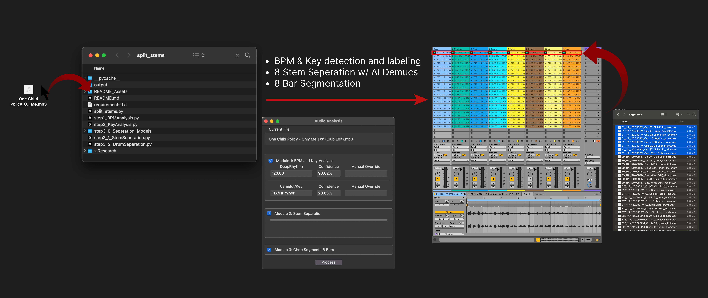
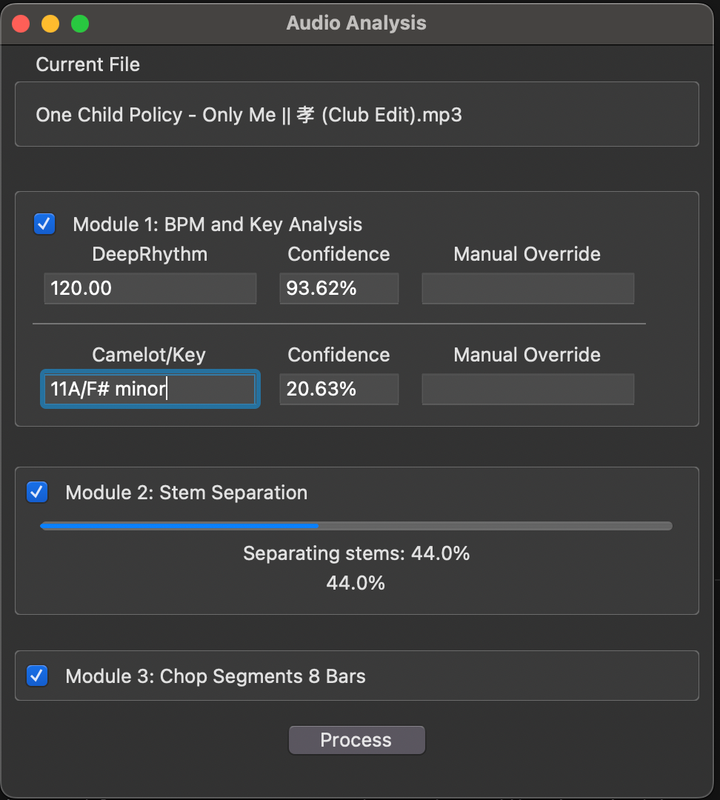

# Neural Stem Slicer


> **Note:** For development details and contribution guidelines, see [Developer README](README_Dev.md)

<a href="https://www.paypal.me/onechildpolicy" target="_blank">
  
  
</a>


<br> 
**If you find this program useful please consider donating, currently looking for full time work so anything helps thanks!**</br>


## Directory
- [Overview](#overview)
- [Quick Start](#quick-start)
- [Low Level Architecture](#low-level-architecture)
- [Installation](#installation)
  - [Prerequisites](#prerequisites)
  - [macOS Installation](#macos-installation)
  - [Windows Installation](#windows-installation)
- [Usage](#usage)
- [Updating](#updating)


## Overview


A music production tool / powerful folder that converts any song into 8 stems (bass, vocal, other(melodic), drums, kick, snare, tom, cymbal) labeled by BPM and Key, and then each stem into into 8 bar segments.

```
          ┌─────────────────-─┐       ┌─────────────────────┐      ┌─────────────────────┐
          │ Module 1          │       │  Module 2           │      │   Module 3          │
 Song ──> │ BPM Key Analysis  │  ──>  │  8 Stem Separation  │ ──>  │  8-Bar Segments     │  ──> Segments/Stems  
          │ (DeepRhythm)      │       │  (2 stage Demucs)   │      │  (SoundFile)        │
          │ (Librosa)         │       │                     │      │                     │
          └─────────────────-─┘       └─────────────────────┘      └─────────────────────┘
```


## Quick Start
1. After [installation](#installation), place any `.mp3` or `.wav` file in the root folder
2. Double click `split_stems.command` to run the process
3. Neural Stem Slicer will automatically:
   - Split tracks into 8 high-quality stems using Demucs Hybrid Transformers
     - Bass, Vocals, Melody, Drums
     - Drums → Kick, Snare, Toms, Cymbals
   - Detect and label all files with BPM and key using deep learning analysis (with manual override)
   - Segment each stem into precise 8-bar loops ready for Ableton Complex warping
4. All output files should be in the `/output` folder
<br>

Perfect for:

**Music Production & Sampling/Hardware**
- Create custom loops for Ableton Session view
- Extract clean stems for remixing and sampling
- Build your own custom loop collections labeled by BPM/Key
- Extract usable stems from vinyl rips
- Load stems into hardware (samplers, drum machines, groove boxes)
- Study arrangements by analyzing each 8 bar segment

**Live Performance & DJing**
- Generate clean acapellas and instrumentals
- Create perfectly-timed drum loops for live layering
- Build custom DJ tools and transition elements
- Study arrangement and mixing techniques
- Extract vocals and music beds for content creation


## Low Level Architecture


---


## Installation
### Prerequisites
- Git ([Download Git](https://git-scm.com/downloads))
  - macOS: `brew install git`
  - Windows: Download installer from git-scm.com
- Python 3.11 ([Download Python](https://www.python.org/downloads/))
  - macOS: `brew install python@3.11`
  - Windows: Download installer from python.org
- macOS (including Apple Silicon), Linux, or Windows

### Setup
```bash
# Clone repository
git clone https://github.com/dennisrcao/neural-stem-slicer.git
cd neural-stem-slicer
```

### macOS Installation
```bash
# Verify Python installation
python3.11 --version  # Should show Python 3.11.x

# Create virtual environment
python3.11 -m venv .venv

# Activate virtual environment
source .venv/bin/activate

# Install dependencies
pip install -r requirements.txt

# Install tkinter for Python 3.11
brew install python-tk@3.11

# Install drumsep model
python step3_0_Seperation_Models/drumsep/drumsepInstall.py

# Make it executable
chmod +x step3_0_Seperation_Models/drumsep/drumsep
```

### Windows Installation
```bash
# Install Python 3.11 from python.org

# Verify installation
python --version  # Should show Python 3.11.x

# Create virtual environment
python -m venv .venv

# Activate virtual environment
.venv\Scripts\activate

# Install dependencies
pip install -r requirements.txt

# Install drumsep model
python step3_0_Seperation_Models/drumsep/drumsepInstall.py
```

---

## Usage
After you've finished the setup installation process, you can either double click the file `split_stems.command` or in your terminal  run 
```bash
python split_stems.py
```

This should bring up the GUI which I may get rid tbh. 



For now you can select which steps/modules it goes through with the checkboxes. 

**Module 1**: I calculate the BPM and Key, if they are incorrect you can enter in a value into the Manual Override box

**Module 2**: Stem Seperation - 8 stage demucs stem seperation. 

**Module 3**: Segmentation - Chops each 8 step into perfect 8 bar segments (based on knowing the correct BPM). 
❗**Currently you need to export your song starting right at the "1" beat as I'm still in the process of implementing on beat detection**

---

## Updating
I will occasionally be pushing updates to this repository, to make sure you have the latest version follow the steps:
```
# cd into the project repo
cd neural-stem-slicer
# pull down latest changes
git pull origin main
```


