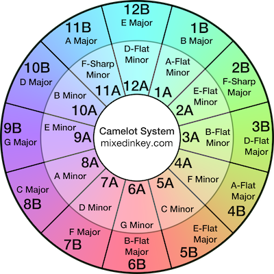

# Split Stems
---
## High Level Architecture
 `step1_BPMAnalysis.py` - analyzes BPM and prepends "BPM_" to a copy of the song and puts in folder `/output` where BPM is a number
 `step2_KeyAnalysis.py` - analyzes Key of song, maps it to Camelot Wheel Notation, and prepends "Key_" where Key = 1A, 2B, 12B, etc. 
 

 **Notes: set explorer.sortOrder to "mixed" 


#### Prerequisites
- Python 3.11 (recommended) or Python 3.8-3.11
- macOS (including Apple Silicon), Linux, or Windows

```bash
brew install python@3.11
```

Verify the installation:
```bash
python3.11 --version  # Should show Python 3.11.x
```

#### Set Up Virtual Environment
```bash
# Create virtual environment
python3.11 -m venv .venv

# Activate virtual environment
source .venv/bin/activate  # On macOS/Linux
# OR
.venv\Scripts\activate  # On Windows

# Install dependencies
pip install -r requirements.txt
```

```bash
# Install drum separator
cd drumsep
bash drumsepInstall

# Install synth separator
cd ../synthsep
bash synthsepInstall
```

### Step 4: Run the Splitter
```bash
python split_stems.py
```

### Troubleshooting
If you need to recreate the virtual environment:
```bash
deactivate
rm -rf .venv
python3.11 -m venv .venv
source .venv/bin/activate  # On macOS/Linux
pip install -r requirements.txt
```

### Algorithm
Based on [DeepRhythm](https://github.com/bleugreen/deeprhythm)