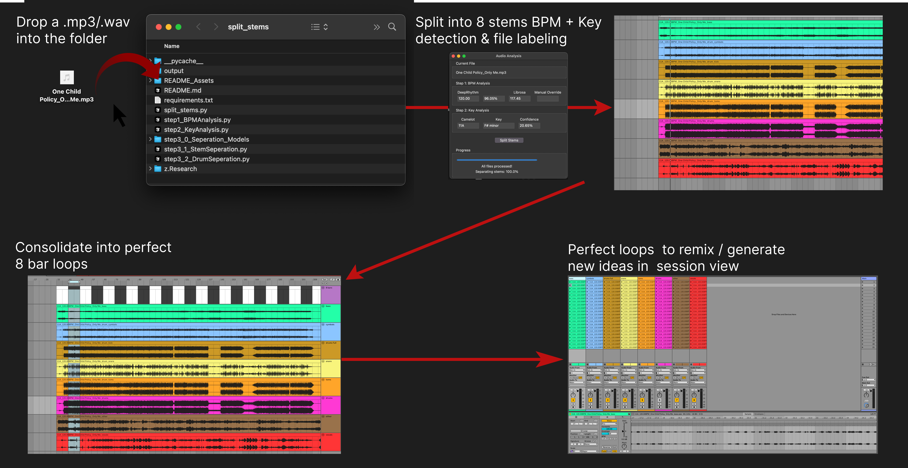
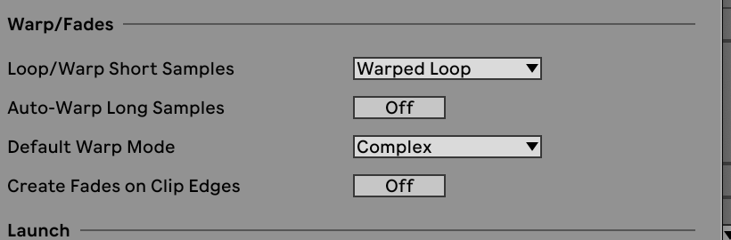

# Neural Stem Slicer


> **Note:** For development details and contribution guidelines, see [Developer README](README_Dev.md)
---


## Overview
Transform any song into perfectly organized, production-ready stems with just a drag and drop. Neural Stem Slicer intelligently processes your audio files (`.mp3/.wav`) and automatically:
- Splits tracks into 8 high-quality stems using neural networks 
(bass, vocals, melody, full drums, kick, toms, snare, cymbals)
- Detects and labels BPM and key using deep learning analysis (with manual override)
- Segments each stem into precise 8-bar loops ready for Ableton Complex warping in Session View


---
## Audience

### Music Production & Remixing
- Create custom loop libraries from your favorite tracks (labeled by BPM/Key)
- Extract clean stems from vinyl rips - ready for hardware samplers or DAWs
- Breathe new life into old project stems with perfect 8-bar segments
- Build instant remix-ready material with neural-separated stems
- Generate Ableton-ready warped segments for Session View experimentation

### DJing & Live Performance
- Create clean acapellas and instrumentals using AI separation
- Extract perfectly-timed drum loops for live percussion layers
- Build custom DJ tools with precisely isolated elements
- Generate transition-ready segments in your library's key format

### Creative & Educational
- Break down songs into individual elements for study or practice
- Create clean backing tracks with high-quality stem separation
- Extract vocals and music beds for content creation

Just drag in any audio:
- Full songs you want to sample or study
- Old project stems that need organization
- Vinyl rips for clean separation







## Directory
- [Prerequisites](#prerequisites)
- [Installation](#installation)
  - [macOS Installation](#macos-installation)
  - [Windows Installation](#windows-installation)
- [Usage](#usage)
- [High Level Summary](#high-level-summary)
- [Low Level Architecture](#low-level-architecture)
- [Troubleshooting](#troubleshooting)


## Low Level Architecture


## Prerequisites
- Python 3.11 (recommended) or Python 3.8-3.11
- macOS (including Apple Silicon), Linux, or Windows

## Installation

### macOS Installation
```bash
# Install Python 3.11
brew install python@3.11

# Verify installation
python3.11 --version  # Should show Python 3.11.x

# Create virtual environment
python3.11 -m venv .venv

# Activate virtual environment
source .venv/bin/activate

# Install dependencies
pip install -r requirements.txt

# Install tkinter for Python 3.11
brew install python-tk@3.11

# Install drumsep model
python step3_0_Seperation_Models/drumsep/drumsepInstall.py

# Make it executable
chmod +x step3_0_Seperation_Models/drumsep/drumsep
```

### Windows Installation
```bash
# Install Python 3.11 from python.org

# Verify installation
python --version  # Should show Python 3.11.x

# Create virtual environment
python -m venv .venv

# Activate virtual environment
.venv\Scripts\activate

# Install dependencies
pip install -r requirements.txt

# Install drumsep model
python step3_0_Seperation_Models/drumsep/drumsepInstall.py
```

## Usage
```bash
python split_stems.py
```

## Troubleshooting
If you need to recreate the virtual environment:
```bash
deactivate
rm -rf .venv
python3.11 -m venv .venv
source .venv/bin/activate  # On macOS/Linux
pip install -r requirements.txt
python step3_0_Seperation_Models/drumsep/drumsepInstall.py
```

